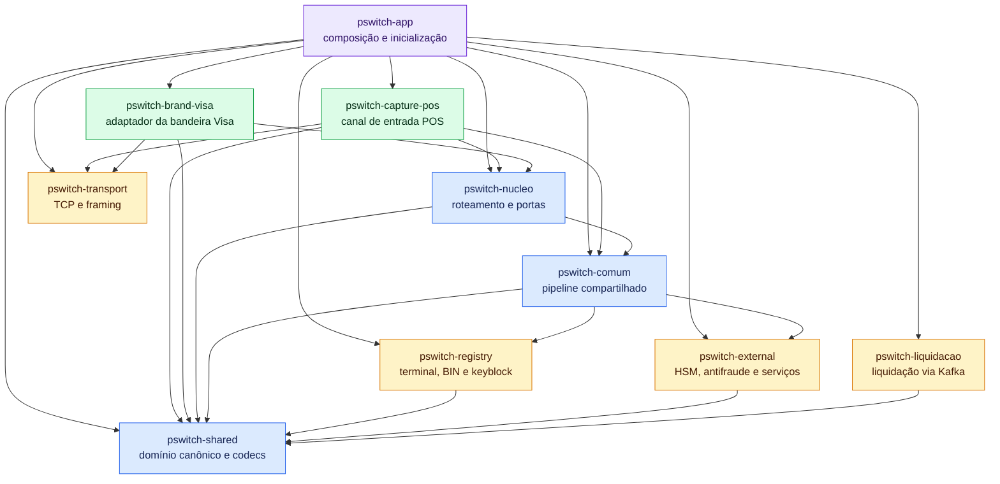
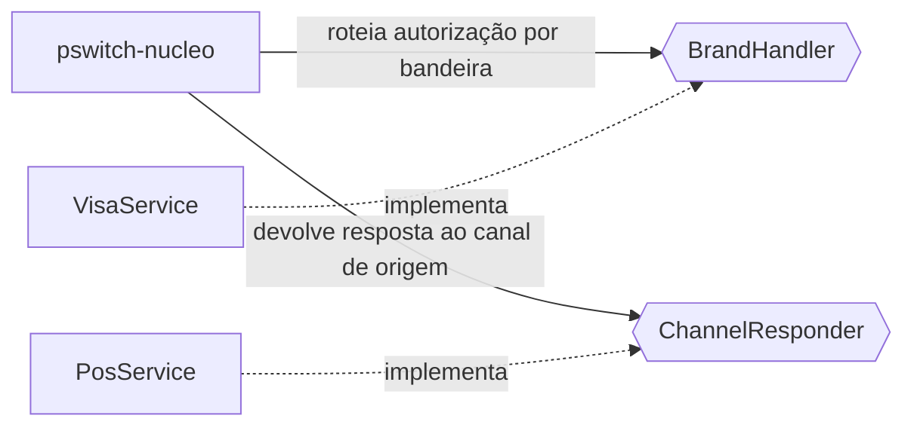
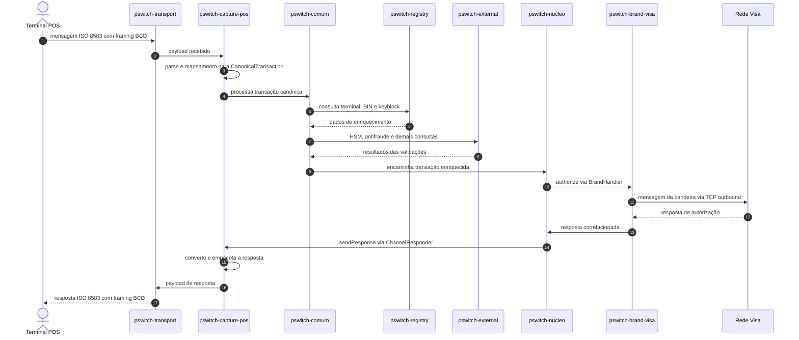

# Relacionamento entre os módulos

Este documento mostra a composição do switch, suas dependências de compilação e o fluxo esperado de uma autorização. O código atual ainda é um esqueleto; portanto, o segundo diagrama representa o fluxo arquitetural planejado.

## Dependências entre módulos

As setas significam **“depende de”**. O módulo `pswitch-app` é o ponto de composição: inicia o Spring Boot e reúne todos os demais módulos no mesmo processo.

### Papel das portas

O núcleo não conhece diretamente Visa nem POS. Ele publica dois contratos que invertem essas dependências:

Essa inversão mantém o grafo Maven acíclico e permite incluir outras bandeiras ou canais sem criar uma dependência direta no núcleo.

## Fluxo planejado de uma autorização POS

## Leitura rápida

- `pswitch-shared` contém os contratos e codecs usados transversalmente.
- `pswitch-transport` cuida somente do transporte TCP e do enquadramento das mensagens.
- `pswitch-capture-pos` traduz o protocolo do terminal para o modelo canônico e vice-versa.
- `pswitch-comum` enriquece e valida a transação usando registries e integrações externas.
- `pswitch-nucleo` escolhe o adaptador de bandeira e retorna a resposta ao canal correto.
- `pswitch-brand-visa` traduz e transporta mensagens específicas da Visa.
- `pswitch-liquidacao` trata o fluxo assíncrono posterior de liquidação.

