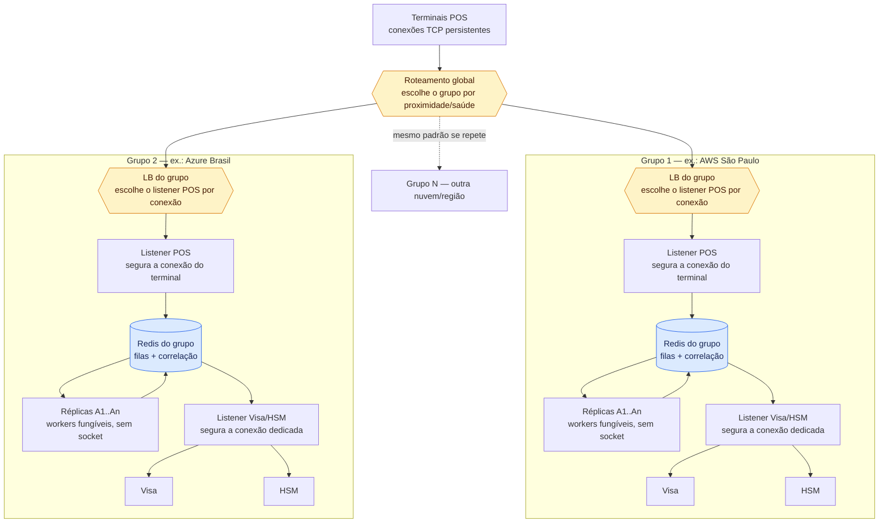
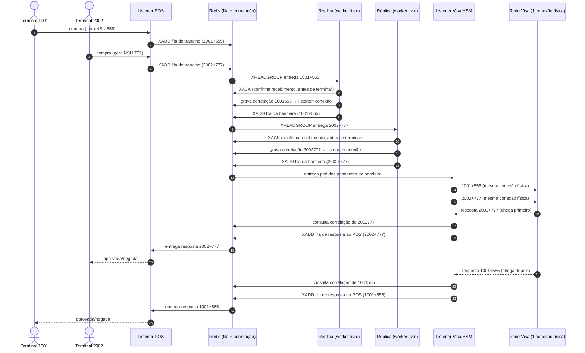

# Topologia de implantação — grupos shared-nothing

Este documento registra o raciocínio por trás de como o `pswitch` deve escalar horizontalmente em
produção, discutido a partir do comportamento atual do `VisaService` (mapa de correlação em memória,
ver `pswitch-brand-visa/src/main/java/com/guzula/pswitch/brand/visa/VisaService.java`).

Referência real usada como ponto de partida: o modelo atual da Cielo — 4 servidores Stratus
(tolerantes a falha por hardware) isolados entre si, com um BIG-IP na entrada distribuindo as
conexões de POS. Este documento adapta esse padrão para rodar em VMs/containers comuns de nuvem,
possivelmente em múltiplas nuvens/regiões.

## Dois níveis de isolamento

Não há nenhuma aresta entre `Grupo 1` e `Grupo 2` no diagrama — isso é proposital, não uma omissão.

- **Entre grupos: shared-nothing total.** Um grupo não sabe que o outro existe, não troca estado
  algum, e por isso pode estar em qualquer nuvem ou região sem custo de coordenação.
- **Duas decisões de roteamento, não uma.** O roteamento global escolhe o grupo; dentro dele, o
  **LB do grupo** escolhe qual *listener POS* atende aquela conexão TCP específica — por round-robin,
  menos conexões ativas, ou hash da origem. Não há significado de negócio nessa escolha: o terminal
  1001 cai num listener só porque foi o que o LB decidiu no instante em que a conexão abriu, e fica
  ali (sticky) até a conexão cair.
- **Dentro de um grupo, ninguém segura socket exceto os listeners.** O *Listener POS* segura a conexão
  do terminal; o *Listener Visa/HSM* segura a conexão dedicada com a bandeira. As réplicas (`A1..An`)
  são workers puros — leem trabalho do Redis do grupo, processam, escrevem a resposta de volta no
  Redis. Nenhuma réplica tem afinidade com nenhuma conexão.

## Como o fluxo funciona dentro de um grupo

O Redis do grupo (Redis Streams) faz três papéis ao mesmo tempo:

1. **Fila de trabalho** — o Listener POS publica cada mensagem recebida; qualquer réplica livre do
   consumer group pega o próximo item (“quem estiver disponível processa”).
2. **Correlação** — quando uma réplica decide que precisa autorizar com a Visa, ela grava
   `terminalId+NSU → listenerId+connectionId` no Redis (substitui o `pendingByCorrelationKey` que hoje
   vive só na memória do `VisaService`) antes de publicar o pedido na fila da bandeira.
3. **Fila de resposta** — o Listener Visa/HSM, ao receber a resposta da bandeira, consulta a
   correlação pra saber a qual conexão de terminal ela pertence e publica na fila de resposta que o
   Listener POS consome.

**Ack antecipado, não tardio.** A réplica confirma (`XACK`) assim que recebe a mensagem da fila de
trabalho, antes de terminar de processar — assim uma queda do worker nunca reprocessa a mesma
autorização duas vezes (o que poderia significar mandar a mesma transação pra Visa duas vezes). O
preço é que, se a réplica cair no meio do processamento, aquela transação simplesmente nunca chega a
ser respondida.

**Por que isso é seguro:** esse "nunca respondida" não é um buraco — ele se resolve pelos mesmos dois
mecanismos que já existem/estão previstos para "a bandeira não respondeu":

1. O terminal, ao não receber resposta, manda um desfazimento — já modelado em
   `PosConstants.Mti.UNDO` (1400) e `REVERSAL` (1420).
2. Se a Visa chegou a aprovar mas o switch perdeu o rastro antes de confirmar pro terminal, existe a
   nota já registrada em `TransactionStorageService.java:8-10` prevendo um reversal automático
   disparado pelo próprio switch (MTI 0420), sem depender do terminal perceber.

Isso significa: perder uma mensagem no meio do processamento nunca deixa uma transação em estado
ambíguo por muito tempo — ela sempre acaba sendo desfeita, de um lado ou do outro.

## Exemplo concreto: dois terminais, uma conexão física com a Visa

Dois terminais autorizam quase ao mesmo tempo, cada um processado por uma réplica diferente do mesmo
grupo. Só existe **uma** conexão TCP com a Visa — a resposta do segundo pedido chega antes da do
primeiro, de propósito, pra mostrar que nada nesse desenho depende de ordem.

O que fica claro no desenho: nenhuma réplica precisa ser "a mesma" que recebeu o pedido original — A1
e A2 só aparecem porque estavam livres no momento; poderiam ter sido A2 e A1, ou a mesma réplica pras
duas. Quem garante que a resposta acha o caminho de volta certo é a correlação gravada no Redis, não a
identidade da réplica.

## O que define um "grupo" nessa arquitetura

Um grupo é o conjunto de réplicas e listeners apontando para o **mesmo Redis**. Não existe registro de
conexão manual nem eleição de líder — entrar no grupo é só subir uma réplica nova configurada com a
mesma string de conexão; ela já começa a competir pela fila de trabalho imediatamente.

Duas consequências decorrem disso:

- **A regra de co-localização não desaparece, só muda de dono.** Réplicas e listeners de um grupo
  ainda precisam estar perto do Redis daquele grupo (mesma região/AZ) — é ele quem entra no caminho
  crítico de cada transação.
- **O Redis herda a mesma dependência que qualquer coordenador central teria.** Se o Redis do grupo
  cair, o grupo inteiro para — nenhuma réplica processa, nenhum listener correlaciona — mesmo com
  réplicas e listeners saudáveis. Por isso ele precisa da própria redundância, não pode ser uma
  instância única sem failover.
- **Redundância aqui é disponibilidade, não durabilidade — são eixos independentes.** Como perder o
  conteúdo desse Redis nunca causa duplicidade (o pior caso é uma transação ficar sem resposta, já
  coberto pelo desfazimento do terminal e pelo reversal do switch — ver seção anterior), não há motivo
  pra pagar o custo de disco (RDB/AOF): ele pode rodar 100% em memória. O que ele ainda precisa é de
  uma ou mais réplicas (também em memória) por trás de um Sentinel ou Cluster, só pra que a queda de um
  nó não pare o grupo até ele voltar — sem isso ser sobre persistir dado nenhum em disco.

## Por que a fronteira do grupo é uma decisão de latência, não de nuvem

O Redis do grupo entra no caminho crítico de toda transação — por isso as réplicas e os listeners de
um mesmo grupo precisam estar próximos (mesma região/AZ), nunca espalhados (ex.: uma no RJ e outra em
SP, ou uma na AWS e outra na Azure). Isso adicionaria latência de rede e risco de partição a cada
autorização. Grupos diferentes não têm essa restrição — cada um pode estar em qualquer lugar.

## Trade-offs em aberto

- **Tamanho do grupo é um compromisso.** Mais réplicas processam em paralelo à vontade (são
  fungíveis), mas o número de *listeners* Visa/HSM — e portanto de conexões físicas com a bandeira —
  continua limitado pelo que ela concede. Não há um número certo sem saber quantas conexões cada
  bandeira contrata.
- **O tipo de load balancer importa**, nos dois níveis (global e do grupo). Um LB de passthrough (ex.:
  AWS NLB) preserva a conexão do POS até o listener de trás — a afinidade é automática. Um LB que
  termina a conexão e a remultiplexa (como o BIG-IP em modo proxy) só mantém afinidade se a
  persistência de sessão estiver configurada explicitamente.
- **VMs comuns de nuvem não são Stratus.** Sem hardware tolerante a falha, a resiliência vem de
  operação — margem de capacidade acima do necessário (N+2, não N+1) e detecção rápida de falha no
  load balancer — não de tentar imitar a redundância interna de um Stratus.
- **O sweep de timeout precisa de um novo dono.** Hoje o `VisaService.sweepExpiredAuthorizations` varre
  o mapa inteiro a cada `pswitch.visa.timeout-sweep-interval` (O(n), aceitável em volume baixo, mas o
  primeiro ponto a revisar antes de qualquer teste de carga). Nessa arquitetura, a responsabilidade
  equivalente — "essa transação está esperando resposta há tempo demais, nega por timeout" — passa a
  viver no *Listener POS*, que é quem sabe quais conexões ainda não receberam resposta.
- **Disciplina de ack antecipado precisa ser respeitada em todo consumidor da fila.** Um ack tardio por
  engano, em qualquer ponto, reintroduz o risco de duplicidade que esse desenho existe para evitar.

## Estado atual

Nenhuma dessas decisões está implementada — o código de hoje roda como um único processo
(`pswitch-app`) sem separação de grupos, listeners ou filas. Este documento existe para não perder o
raciocínio até que o volume real e o número de conexões contratadas com cada bandeira tornem essa uma
decisão concreta.

Uma versão anterior deste documento explorava um coordenador dedicado por grupo, falando TCP direto
com cada réplica e mantendo dois mapas de correlação em memória. Foi descartado em favor do desenho
acima porque o Redis Streams já resolve nativamente "quem está livre processa" e a reentrega de
mensagens não confirmadas, exigindo menos código de correlação escrito à mão.
